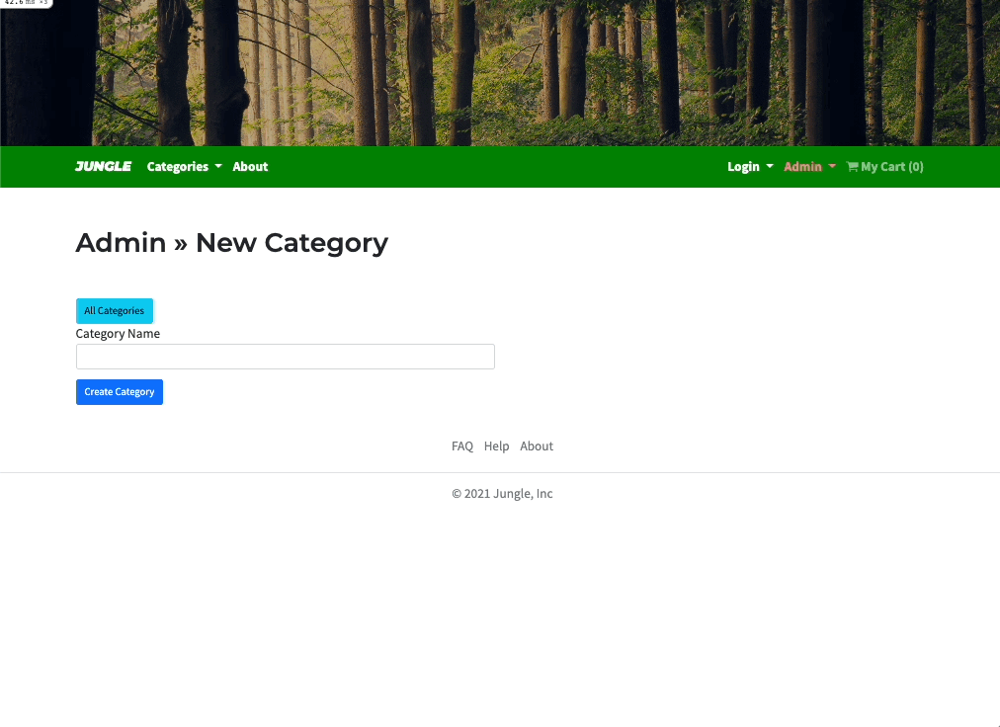

# Jungle

A mini e-commerce application built with Rails 6.1 for purposes of teaching Rails by example.


> Jungle homepage


> Register for an account


> Checkout process for a logged in user


> Message for empty cart


> Admin dashboard, with ability to add new products and categories


> Admin has ability to add new categories

## Getting Started

1. Fork and clone the repository
2. Run `bundle install` to install dependencies
3. Create `config/database.yml` by copying `config/database.example.yml`
4. Create `config/secrets.yml` by copying `config/secrets.example.yml`
5. Run `bin/rails db:reset` to create, load and seed db
9. Create `.env` file based on `.env.example`
10. [Sign up for a Stripe account](https://dashboard.stripe.com/register)
11. Put Stripe (test) keys into appropriate `.env` vars
12. Run `bin/rails s -b 0.0.0.0` to start the server

## Database

If Rails is complaining about authentication to the database, uncomment the user and password fields from `config/database.yml` in the development and test sections, and replace if necessary the user and password `development` to an existing database user.

## Stripe Testing

Use Credit Card # `4111 1111 1111 1111` for testing success scenarios. Any other number will result in a failure. For expiration and CVC, use any future date and any 3 digits.

More information in their docs: <https://stripe.com/docs/testing#cards>

## Admin Dashboard Credentials

- username: "Jungle"
- password: "book"

## Dependencies

- Rails 6.1 [Rails Guide](http://guides.rubyonrails.org/v6.1/)
- Bootstrap 5
- PostgreSQL 9.x
- Stripe

## Testing

Run Cypress:
```bash
bin/rails cypress:open
```
- this will run all the tests in the `spec` folder.

Run all rspec tests:
```bash
bin/rspec
```